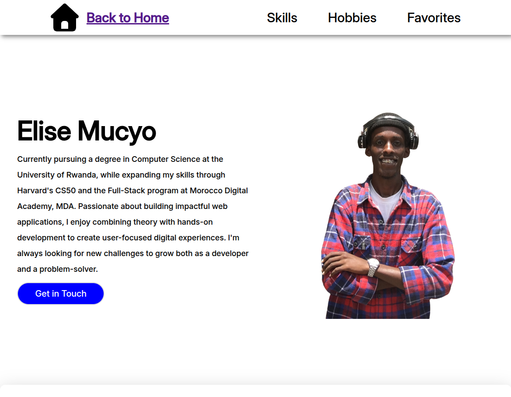
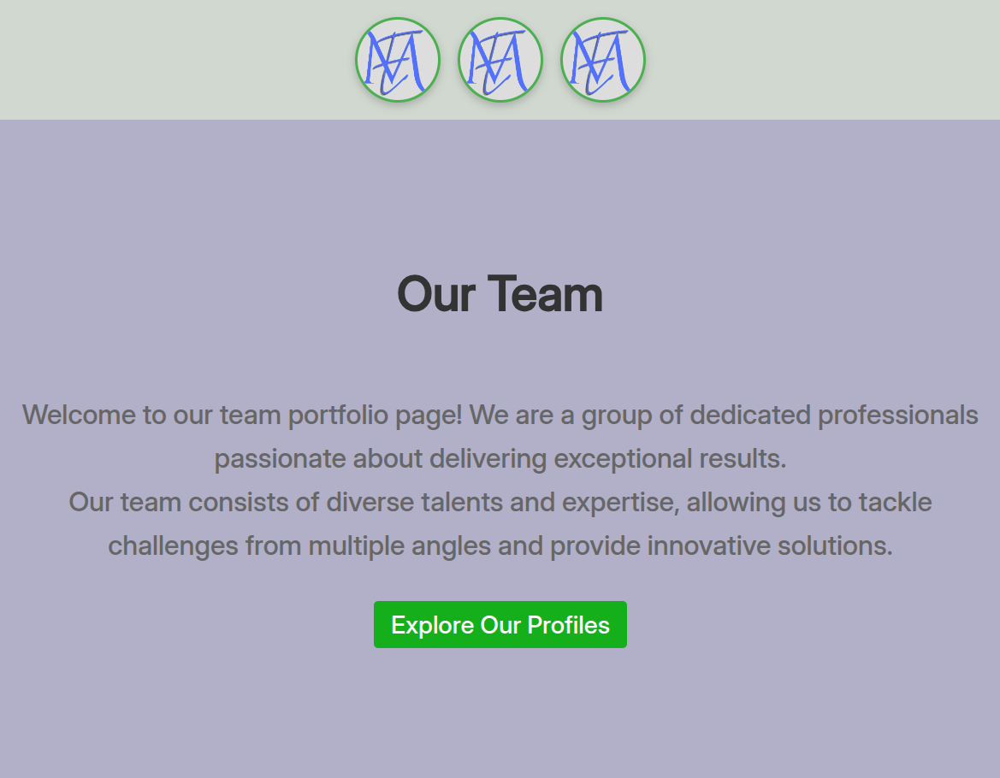
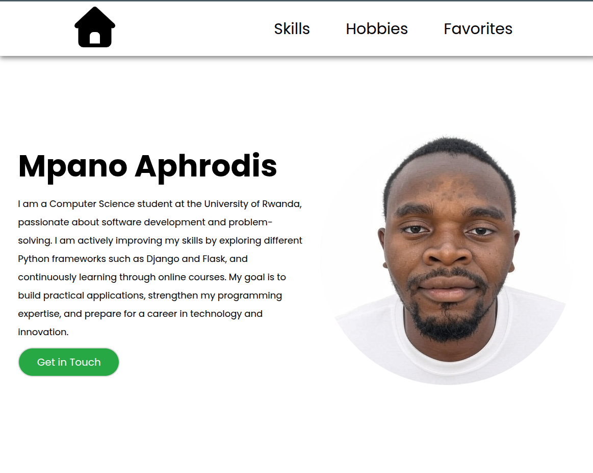
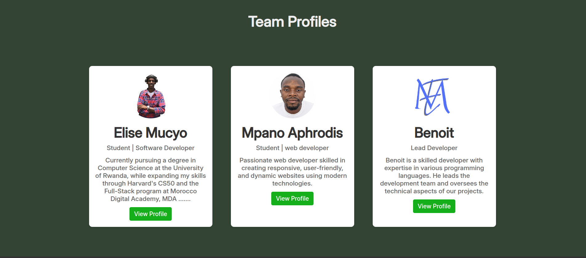

# Team Portfolio Project

## 📋 Project Overview
This repository contains our collaborative group work, where each team member developed their individual portfolio and contributed to the team portfolio.

## 👥 Team Members
- **Elise Mucyo** - [GitHub Profile](https://github.com/mucyoelise) | [Portfolio](https://mucyoelise.github.io/teamportifolio/pages/mucyo.html)
- **Mpano Aphrodis** - [GitHub Profile](https://github.com/Ballet-ux) | [Portfolio](https://mucyoelise.github.io/teamportifolio/pages/mpano.html)
- **Benoit** - [GitHub Profile](link) | [Portfolio](https://mucyoelise.github.io/teamportifolio/pages/benoit.html)

## 🤝 Collaboration Workflow

### Phase 1: Individual Portfolios
Each team member was responsible for creating their own portfolio showcasing their skills, projects, and experience.

### Phase 2: Team Portfolio
After completing individual portfolios, we collaborated on the team portfolio to present our collective work and group projects.

## 👤 Individual Contributions

### Elise Mucyo

**Individual Portfolio Responsibilities:**
- Developed personal portfolio with focus on [specific skills/technologies]
- Designed and implemented [key features of personal portfolio]

***Screenshots:***

*Personal portfolio homepage*

**Team Portfolio Contribution:**
- **Navbar:** Created responsive navigation menu
- **Hero Section:** Designed and developed the landing hero section

***Screenshots:***

*Responsive navigation bar and hero section (Mucyo's work in Team Portifolio)*

---

### Mpano Aphrodis

**Individual Portfolio Responsibilities:**
- Created portfolio highlighting [specific skills/technologies]
- Built [key features of personal portfolio]

***Screenshots:***

*Personal portfolio homepage*

**Team Portfolio Contribution:**
- **Team Profiles Section:** Developed the team member profiles with images, descriptions, and view profiles link

***Screenshots:***

*Team member profiles section (Mpano's work in team portifolio)*

---

### Member 3 Name
**Role:** [e.g., UI/UX Designer]

**Individual Portfolio Responsibilities:**
- Built portfolio showcasing [specific skills/technologies]
- Implemented [key features of personal portfolio]

**Team Portfolio Contribution:**
- **Footer:** Designed and developed the footer section with contact information, social media links, and copyright

**Screenshots:**


*Personal portfolio homepage*


*About me section*


*Footer with contact and social links (Member 3's work)*

---

## 🛠️ Technologies Used

### Individual Portfolios
- HTML5
- CSS3
- Vanilla JavaScript

### Team Portfolio
- HTML5
- CSS3
- Vanilla JavaScript
- Git & GitHub for version control

## 📂 Repository Structure

```
project-root/
├── assets/
│   ├── audios/
│   ├── icons/
│   ├── img/
│   └── screenshots/
|
├── pages/
│   ├── mpano.html
│   ├── mucyo.html
│   └── benoit.html
│   
├── script/
│   └── index.js
|
├── styles/
│   ├── index.css
│   ├── mpano.css
│   ├── mucyo.css
│   └── benoit.css
└── README.md
```

## 📱 Live Demos

- **Elise Mucyo Portfolio:** [Live Link](https://mucyoelise.github.io/teamportifolio/pages/mucyo.html)
- **Mpano Aphrodis Portfolio:** [Live Link](https://mucyoelise.github.io/teamportifolio/pages/mpano.html)
- **Benoit Portfolio:** [Live Link](https://mucyoelise.github.io/teamportifolio/pages/benoit.html)
- **Team Portfolio:** [Live Link](https://mucyoelise.github.io/teamportifolio/)